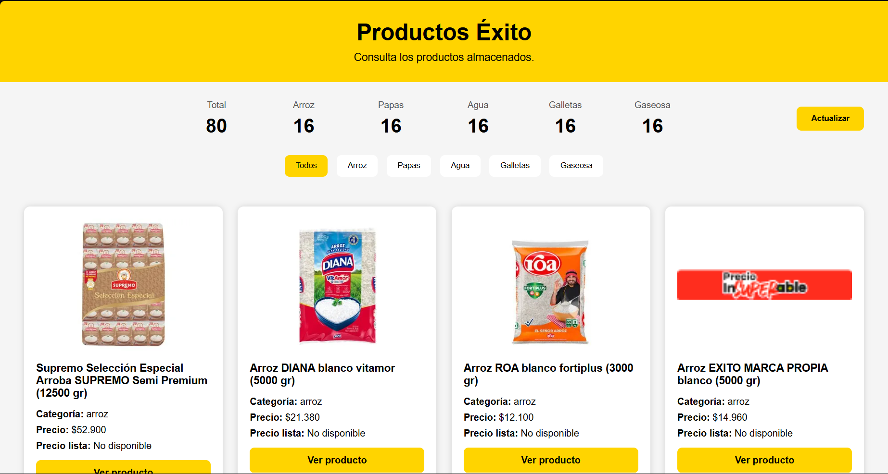

# Web Scraper de Productos Éxito

Proyecto desarrollado para el curso de **Arquitectura y Patrones Avanzados**, cuyo objetivo es una solución integrada para la automatización de la recolección, procesamiento, almacenamiento y presentación de información web.

El sistema está compuesto por cuatro módulos principales:

- Web Scraper desarrollado en Python.
- API RESTful desarrollada en Node.js.
- Base de datos PostgreSQL administrada mediante Supabase.
- Frontend desarrollado con HTML, CSS y JavaScript.

---

# Arquitectura del Proyecto

```text
                 exito.com
                      │
                      ▼
            Web Scraper (Python)
                      │
              Extracción de datos
                      │
                HTTP POST (JSON)
                      │
                      ▼
             API REST (Node.js)
                      │
       ┌──────────────┴──────────────┐
       │                             │
POST /api/items              GET /api/items
       │                             │
       └──────────────┬──────────────┘
                      ▼
             Supabase (PostgreSQL)
                      │
                      ▼
          Frontend (HTML/CSS/JS)
```

---

# Tecnologías utilizadas

## Backend

- Node.js
- Express.js
- Supabase
- dotenv
- CORS

## Web Scraper

- Python
- Selenium

## Base de Datos

- Supabase conPostgreSQL

## Frontend

- HTML
- CSS
- JavaScript

---

# Estructura del proyecto

```text
TALLER1/

│
├── api/
│   ├── controllers/
│   │   └── itemsController.js
│   ├── routes/
│   │   └── items.js
│   ├── services/
│   │   └── supabaseService.js
│   ├── server.js
│   ├── package.json
│   └── .env
│
├── frontend/
│   ├── css/
│   │   └── styles.css
│   ├── js/
│   │   └── app.js
│   └── index.html
│
├── scripts/
│   ├── scraper.py
│
│
├── requeriments.txt
├── .gitignore
└── README.md
```

---

# Funcionalidades

## Web Scraper

El scraper realiza búsquedas automáticas en **Éxito.com** para las siguientes categorías:

- Arroz
- Papas
- Agua
- Galletas
- Gaseosa

Para cada producto obtiene:

- Nombre
- Categoría
- Precio
- Precio de lista
- Imagen
- URL del producto

Al finalizar la extracción genera un JSON y lo envía automáticamente a la API mediante una petición HTTP POST.

---

## API REST

La API desacopla el scraper de la base de datos.

### POST

```http
POST /api/items
```

Recibe un arreglo JSON de productos, valida la información y realiza la inserción masiva en Supabase.

---

### GET

```http
GET /api/items
```

Obtiene todos los productos almacenados, los retorna ordenados cronológicamente, dando respuestas como lo son:

```json
{
    "success": true,
    "items": [
        {
            "nombre": "...",
            "categoria": "...",
            "precio": "...",
            "precio_lista": "...",
            "url": "...",
            "imagen": "...",
            "created_at": "..."
        }
    ]
}
```

---

# Base de datos

La persistencia se realiza mediante **Supabase PostgreSQL**.

Tabla utilizada:

```
scraped_items
```

Campos principales:

- id
- nombre
- categoria
- precio
- precio_lista
- url
- imagen
- created_at

La tabla cuenta con:

- Clave primaria automática.
- Timestamp automático.
- Políticas RLS habilitadas para lectura y escritura.

---

# Frontend

El frontend consume la información mediante:

```http
GET /api/items
```

Su características son:

- Consulta asincrónica mediante Fetch API.
- Visualización mediante tarjetas dinámicas.
- Botón de actualización manual.
- Estadísticas de productos.
- Conteo por categoría.
- Filtro por categoría.

## Vista previa



# Instalación

---

## 1. Clonar el repositorio

```bash
git clone <URL_DEL_REPOSITORIO>

cd NOMBRE_DE_TU_CARPETA_GUARDADA
```

---

## 2. Instalar dependencias del Backend

```bash
cd api

npm install
```

---

## 3. Instalar dependencias de Python

```bash
pip install -r requirements.txt
```

---

## 4. Configurar variables de entorno

Crear un archivo:

```
api/.env
```

Contenido:

```env
SUPABASE_URL=TU_SUPABASE_URL

SUPABASE_KEY=TU_SUPABASE_ANON_KEY
```

---

# Ejecución

## Iniciar la API

```bash
cd api

npm run dev
```

---

## Ejecutar el Web Scraper

```bash
cd scripts

python scraper.py
```

El scraper enviará automáticamente la información a la API.

---

## Abrir el Frontend

Abrir el archivo:

```
frontend/index.html
```

mediante un servidor local, en este caso y durante el desarrollo se hizo con Live Server en Visual Studio Code.

---

# Flujo del sistema

```text
1. Python ejecuta el scraper

↓

2. Se obtienen los productos desde Éxito.com

↓

3. Se genera un JSON

↓

4. POST /api/items

↓

5. Supabase almacena los registros

↓

6. El Frontend realiza:

GET /api/items

↓

7. Se renderizan las tarjetas dinámicamente
```

---

# Autor

**Juan José Campos Covaleda** - Universidad de La Sabana
